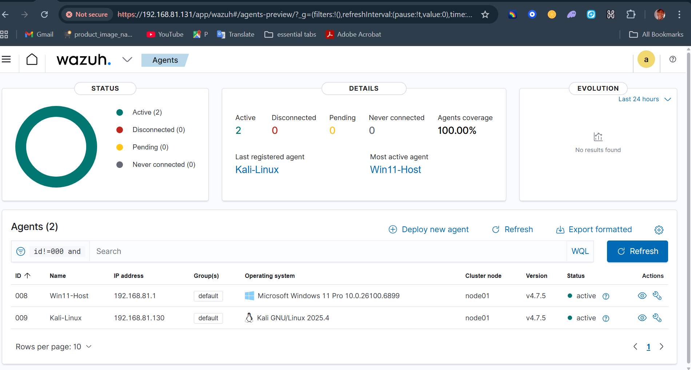
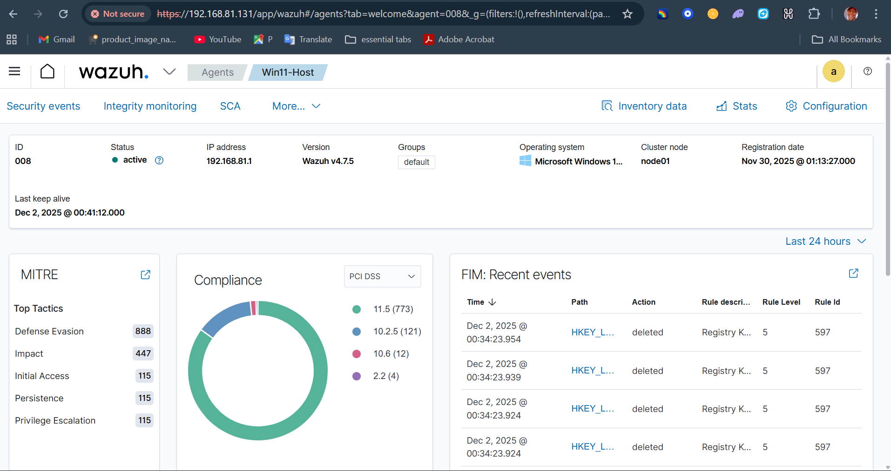
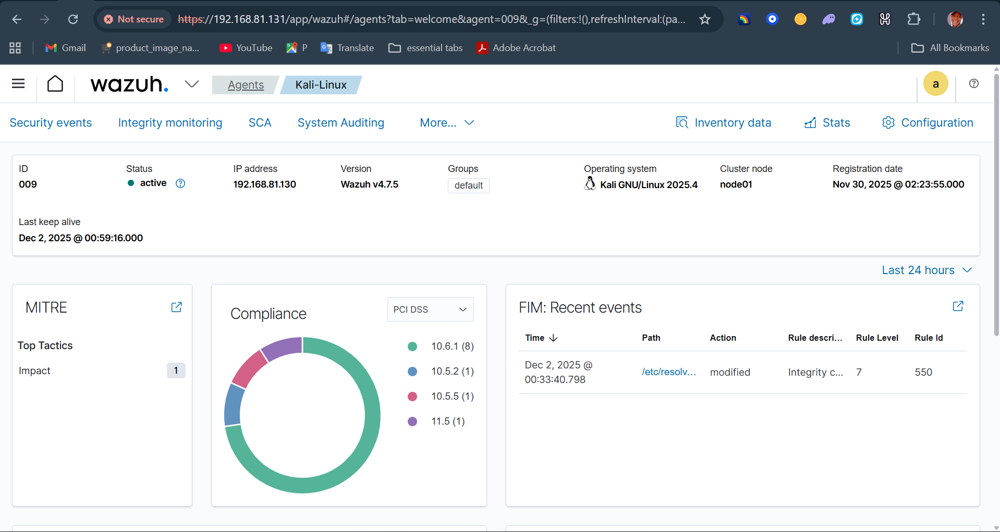
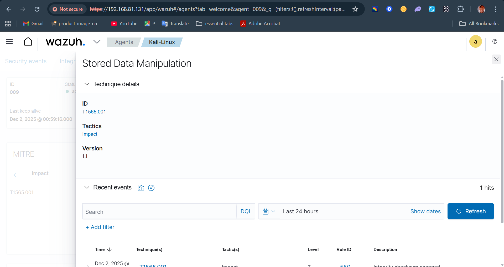

# 👋 Hi, I'm Kelechukwu Uzor

### 🔐 Cybersecurity Analyst | Pentesting & SOC Analyst | Home Lab Builder  

I’m an entry level Security analyst focused on **penetration testing**, **SOC operations**, and building practical labs to strengthen hands-on skills. I enjoy solving CTFs, analyzing vulnerabilities, investigating threats, and documenting my journey in Cybersecurity.

---

## 🧰 SKILLS & TOOLS
- **Pentesting:** Nmap, Burp Suite, Metasploit, Hydra, John the ripper, Gobuster  
- **SOC / Blue Team:** Wazuh, SIEM basics  
- **Networking:** TCP/IP, DNS, HTTP/HTTPS, Wireshark  
- **Systems:** Linux (Kali, Ubuntu), Windows Administration  
- **Scripting:** Bash, Python (beginner)  
- **Labs:** VMware, VirtualBox, TryHackMe  

---

## 📌 PROJECTS
### 🔹 **Home SOC Lab (Wazuh + Ubuntu + Windows)**
A full SOC environmenT(Wazuh) detecting vulnerabilities, MITRE attacks, suspicious behaviors, and Windows event logs.

  
  

  
  

<!-- ### 🔹 **CTF Writeups**
Documented walkthroughs of TryHackMe and HackTheBox challenges using professional pentesting methodology.-->

## 🎓 Certifications & Badges

Check out my Cisco badges and certificates:  
[View my Cisco certifications](https://www.netacad.com/profile?tab=badges)

### 🔹 **Web Vulnerability Research**
Hands-on exploitation of SQL Injection.

---

## 🎯 What I'm Learning Now
- Advanced Pentesting Techniques  
- Threat Detection Engineering  
- Practical Malware Analysis  
- Cloud Security (AWS Fundamentals)  

---

## 🔗 Connect With Me
- **LinkedIn:** *https://www.linkedin.com/in/kelechukwu-uzor-498a21398/*  
- **TryHackMe:** *Add your THM profile link*  
- **HackTheBox:** *Add your HTB profile link*  

---

### 🚀 Goal  
To grow into a professional **Cybersecurity Analyst / Pentester**, contribute to open-source security projects, and build a portfolio that reflects real-world skills.

---

### 📫 Contact  
Feel free to reach out for collaboration, learning, or project ideas!
